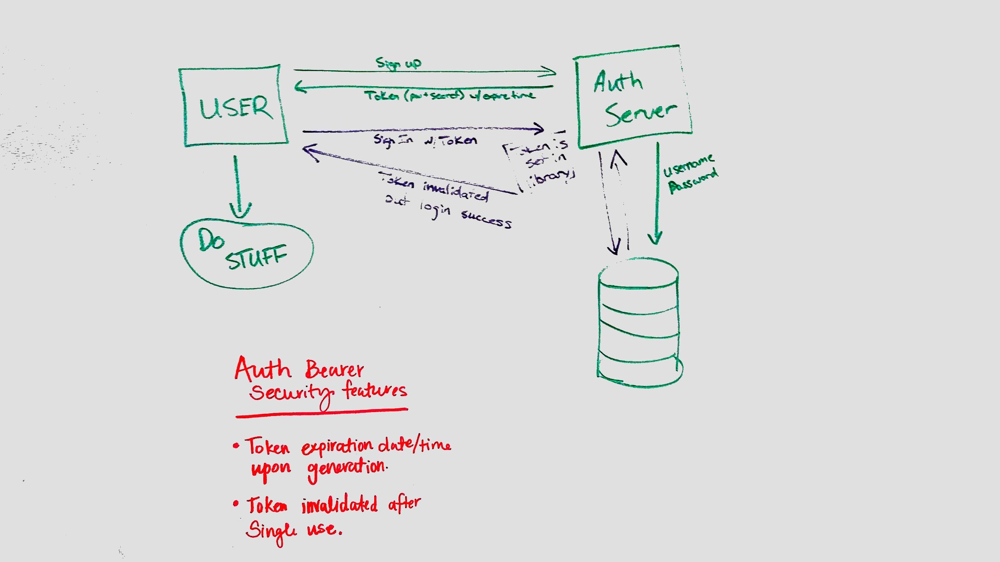

 LAB
=================================================

## Project Name

### Author: Student/Group Name

### Links and Resources
* [Repository](https://github.com/CaityHeath/18-authorization)
* Travis 
* [Heroku back-end](https://auth-bearer.herokuapp.com/) 

#### Documentation
* [jsdoc](https://auth-bearer.herokuapp.com/doc) 

### Modules
#### `middleware.js`
##### Exported Values and Methods

###### `auth(req, res, next) -> string`
This module handles authenticating the password and generating a token. 

#### `users-model.js`
##### Exported Values and Methods

###### `mongoose.model('users', users)`
This module creates an an entry into our store collection in mongoose. It also handles token generation. Two auth bearer security features have been implemented in the authenticateBearer and generateToken methods. 

### Setup
#### `.env` requirements
* `PORT` 8080
* `MONGODB_URI` store
* `SECRET` Assigned by web host

#### Running the app
* `npm start`
* Endpoint: `/signup`
  * post 
* Endpoint: `/signin`
  * post
* Endpoint: `/testing`
  * get
* Endpoint: `/oauth`
  * get
  
#### Tests
* To run tests simply type npm start or reference the travis link above. 
* Tests were written for the middleware and router. Listed below are the tests cases. 
  * login for a user with the incorrect basic credentials throws an error
  * logs in a user with the right credentials
  * User can Sign up 
  * User can Sign in 

#### UML
